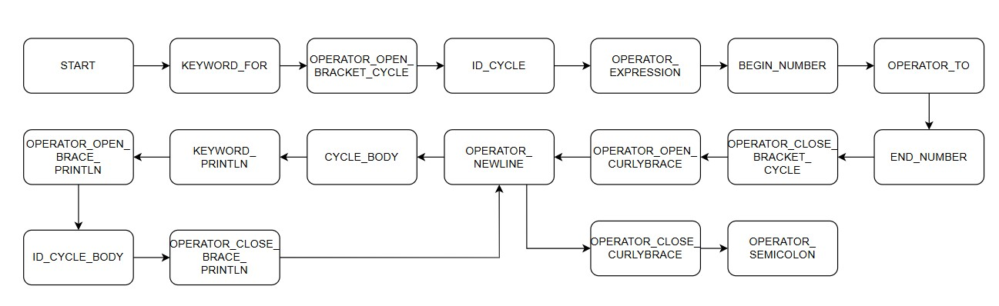
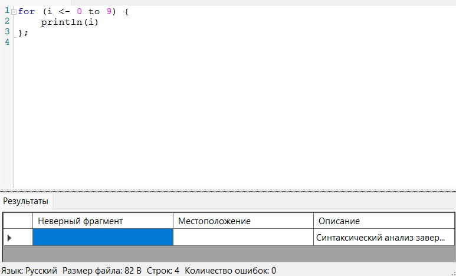
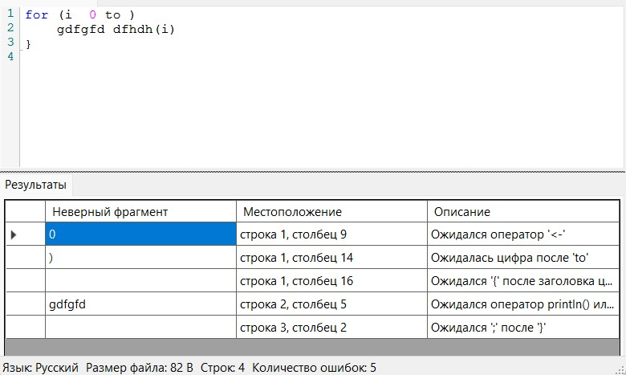
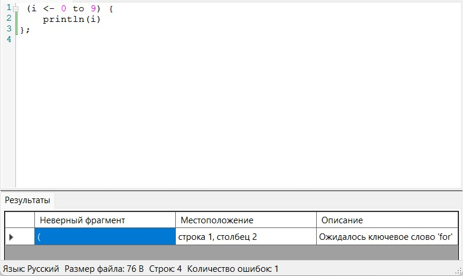
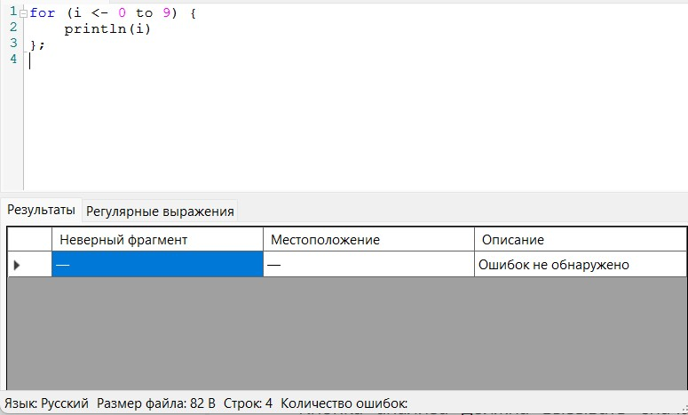
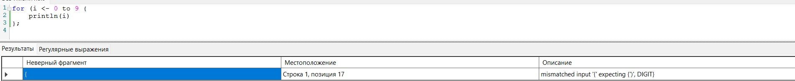
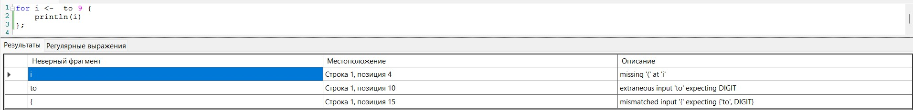
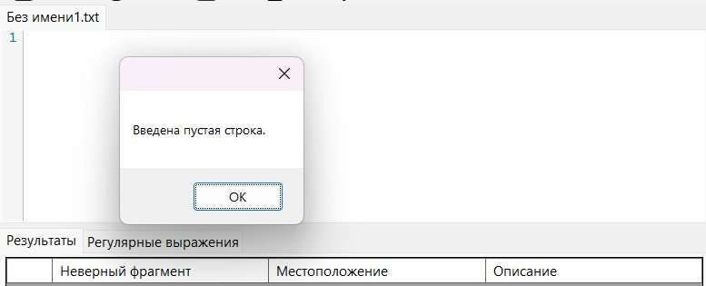
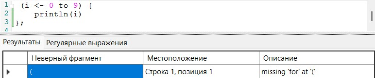

# Лабораторная работа 3. Разработка синтаксического анализатора (парсера).

## Цель работы.  

Изучить назначение и принципы работы синтаксического анализатора в структуре компилятора. 
Спроектировать грамматику, построить соответствующую схему метода анализа грамматики и выполнить программную реализацию парсера с нейтрализацией синтаксических ошибок методом Айронса. 
Интегрировать разработанный модуль в ранее созданный графический интерфейс языкового процессора.

## Сведения об авторе.

Разработал Зенцов Вадим, АВТ-313.

## Постановка задачи

Разработать синтаксический анализатор (парсер) в соответствии с индивидуальным вариантом курсовой (расчетно-графической) работы, 
интегрировать его в приложение из лабораторной работы №1 
и обеспечить наглядный вывод результатов анализа.

## Вариант задания.  

111. Цикл for на языке Scala  

for (i <- 0 to 9) {  
    println(i)  
};  
  
for (a <- 11 to 10000) {  
    println(a)  
    println(b)  
    println(c)  
};  

for (i <- 0 to 9) {  

};  

## Разработка грамматики.

Грамматика, разработанная в рамках лаюораторной работы:

[grammar.txt](grammar.txt)

## Классификация грамматики (по Хомскому)

Данная грамматика является контекстно-свободной. 

Формула для контекстно свободных грамматик:

A → α, A ∈ V_N, α ∈ V*

## Метод анализа.

## Диагностика и нейтрализация ошибок.

Диагностика и нейтрализация ошибок в программе реализована по алгоритму Айронса следующим образом:

1) Встречаем терминальный символ l, который не соответствует грамматике по правилу вывода Q.

2) Пропускаем неправильную контрукцию l, ищем терминальный символ p такой, что Q -> qP, P -> pN, где N - следующий нетерминальный символ.

3) Продолжаем разбор относительно правила P -> pN.

## Тестовые примеры.

## Средство автоматической генерации лексера и парсера ANTLR.

[ANTLRGRAMMAR.txt](ANTLRGRAMMAR.txt)

