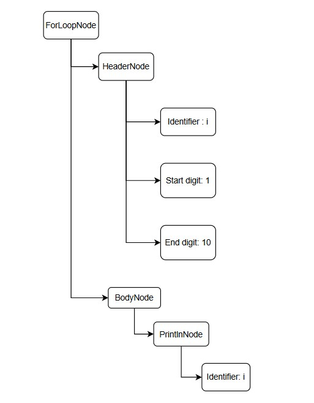
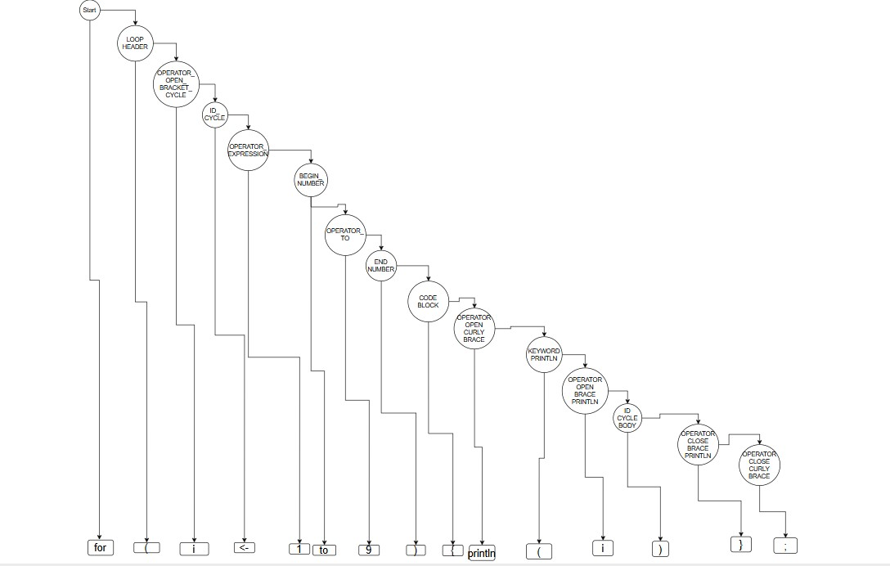
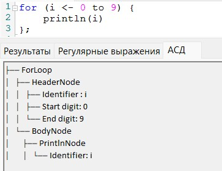
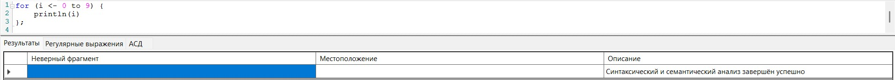
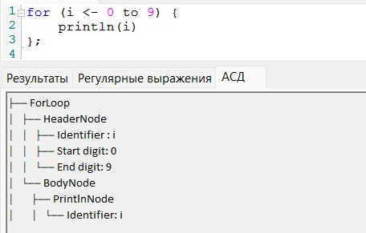
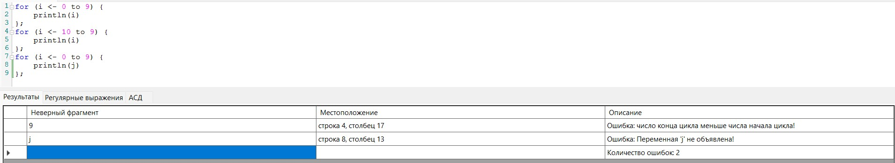
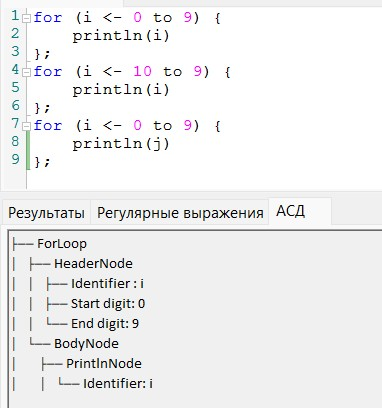

# Лабораторная работа 5. Построение AST и проверка контекстно-зависимых условий.

## Цель работы

Изучить назначение и принципы работы семантического анализатора в структуре компилятора. Освоить методы построения абстрактного синтаксического дерева (AST) и проверки контекстно-зависимых условий (семантических правил) для заданной синтаксической конструкции.

## Постановка задачи

Развить ранее созданный синтаксический анализатор (парсер) до семантического: построить абстрактное синтаксическое дерево (AST) и реализовать проверку контекстно-зависимых условий в соответствии с индивидуальным вариантом курсовой работы.

# ФИО автора

Зенцов Вадим Александрович, группа АВТ-313

# Вариант задания

Цикл for на языке Scala

for (i <- 0 to 9) {

    println(i)

};

for (j <- 10 to 1000) {

    println(j)

};

# Контекстно - зависимые условия

В цикле for на языке Scala были реализованые следующие проверки контекстно-зависимых условий:

Правило 3 (допустимые значения): Проверить, что значение находится в допустимых пределах (для числовых типов). 

Проверка этого правила необходима для того, чтобы в цикле число конца было больше числа начала цикла.

for (j <- 10 to 9) {

    println(j)

};

Ошибка: число конца цикла меньше числа начала цикла!

Правило 4 (использование идентификаторов): Проверить, что используемые идентификаторы были объявлены ранее (для выражений). 

Проверка этого правила нужна для того, чтобы в теле цикла использовался только тот идентификатор, который был объявлен в заголовке цикла.

for (j <- 10 to 9) {

    println(i)

};

Ошибка: Переменная 'i' не объявлена!

# Структура AST.

## Описание типов узлов.

IASTNode - общий для всех узлов интерфейс с методом: 

void Accept(IVisitor visitor);

ForLoopNode - узел цикла for. Содержит в себе два узла: HeaderNode и BodyNode.

HeaderNode - узел заголовка цикла for. Содержит в себе объявленный в заголовке идентификатор, числа начала и конца цикла.

BodyNode - узел тела цикла for. Содержит в себе узел оператора println.

PrintlnNode - узел оператора println. Содержит в себе идентификатор, переданный в аргумент оператора.

## Рисунок AST.

## Рисунок CST.

## Формат вывода AST в программе

# Тестовые примеры

# Инструкция по запуску

Разработанный текстовый редактор обладает возможностью разбиения на токены кода, проверка кода на соответствие грамматике, семантическая (смысловая) проверка кода.

Для запуска необходимо написать код цикла for на языке Scala, нажать кнопку "компиляция" в основном меню приложения, либо на панели быстрого доступа нажать на кнопку со значком "Пуск".

Результаты синтаксического и семантического анализатора будут выведены в таблицу результаты. Во вкладке АСД можно будет посмотреть на построенное по коду абстрактное синтаксическое дерево.