# Название работы и ФИО автора.

Зенцов Вадим, АВТ-313.

# Вариант задания.

## Язык программирования.

Scala

## КС - грамматика.

E → TA

A → ε | + TA | - TA

T → FB

B → ε | * FB | / FB | % FB

F → num | id | (E)

id → letter {letter | digit}

num → digit {digit}

## Примеры верных строк.

x * y + z / w - k

(a + b) * (c - d)

10 * (x + y) % z

a + (b - c) / d

a * b + c % d

(a + b) * c

a + b * c

# Лексические и синтаксические ошибки

## Диаграмма лексера.

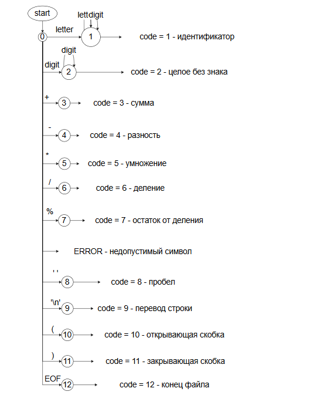

## Схема рекурсивного спуска.

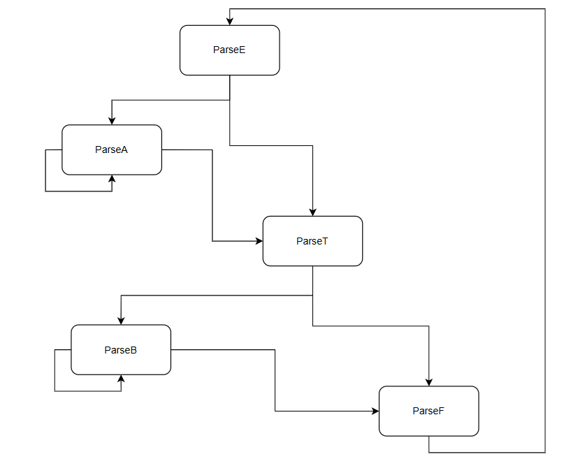

## Тестовый пример лексера.

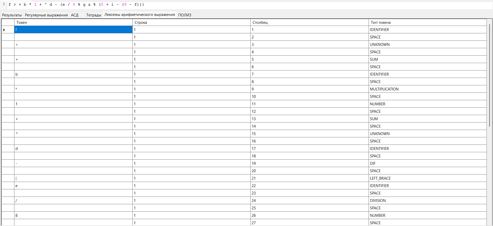

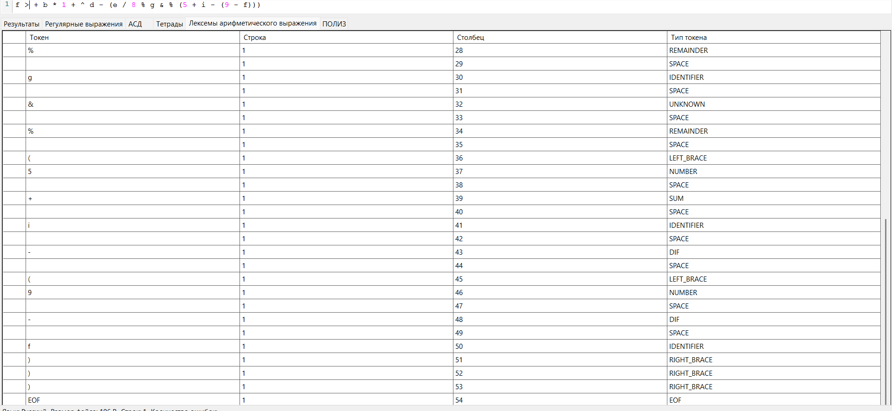

## Тестовые примеры парсера.

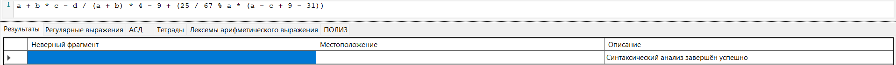

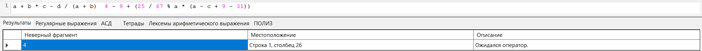

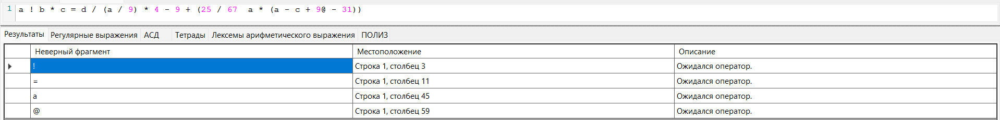

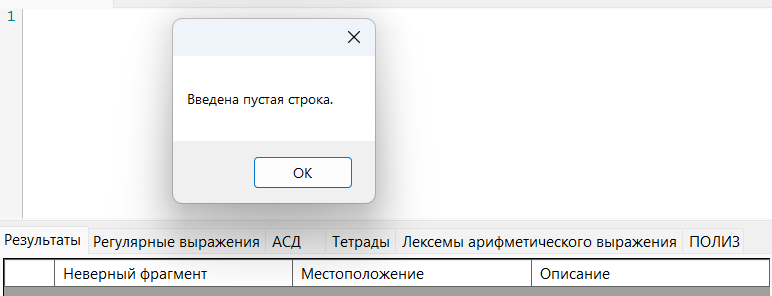

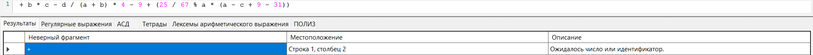

# Внутрення форма представления программы (тетрады).

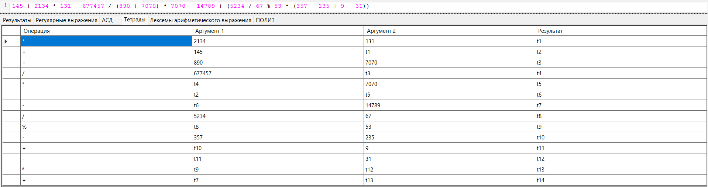

# ПОЛИЗ.

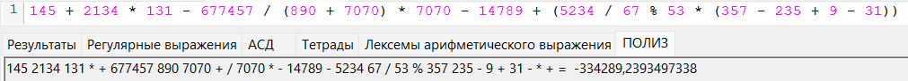