# Лабораторная работа 7. Анализ и преобразование кода с использованием Clang и LLVM.

Цель работы

Познакомиться с инструментарием Clang и LLVM, освоить получение абстрактного синтаксического дерева (AST) и промежуточного представления (LLVM IR) для кода на C/C++, научиться применять базовые оптимизации, строить графы потока управления (CFG), а также анализировать влияние оптимизаций на различные синтаксические конструкции языка.

# Автор.

Зенцов Вадим, АВТ-313

# Постановка задачи.

## Общее задание.

### Общий вариант задания:

#include <stdio.h>

int square(int x) {

 return x * x;

}

int main() {

 int a = 5;

 int b = square(a);

 printf("%d\n", b);

 return 0;

}

### Общая постановка задачи:

1. Установка среды

Установить Clang, LLVM, opt и Graphviz (например, в Ubuntu 26.04).

2. Работа с AST

Сгенерировать абстрактное синтаксическое дерево для заданного C/C++‑файла.

3. Генерация LLVM IR

Получить промежуточное представление кода без оптимизаций (-O0) и с оптимизациями (-O2).

4. Оптимизация IR

Применить оптимизации с помощью opt и/или флагов Clang, сравнить изменения.

5. Построение CFG

Построить граф потока управления для одной или нескольких функций.

6. Индивидуальное задание (по варианту)

Выполнить анализ конкретной синтаксической конструкции в соответствии с вариантом. Сформулировать, как LLVM обрабатывает выбранную конструкцию, какие оптимизации применяются.

7. Выводы

Ответить на контрольные вопросы

## Индивидуальное задание.

### Вариант задания:

int main() {

int sum = 0;

for (int i = 0; i < 10; i++) {

sum += i;

}

return sum;

}

### Задания:

1. Получите IR для -O0.

2. Получите IR для -O2. Раскрыт ли цикл?

3. Примените -unroll-count=4 и сравните.

4. Постройте CFG.

5. Сделайте вывод об оптимизации циклов в LLVM.

# Общее задание.

## Установка среды.

Лабораторная работа выполняется в ОС Ubuntu 26.04

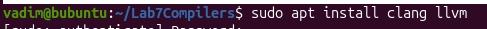

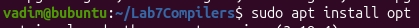

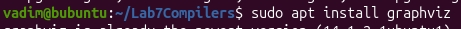

## Работа с AST.

Исходный файл:

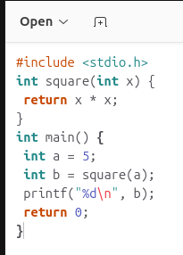

Получение AST:

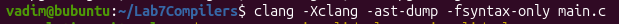

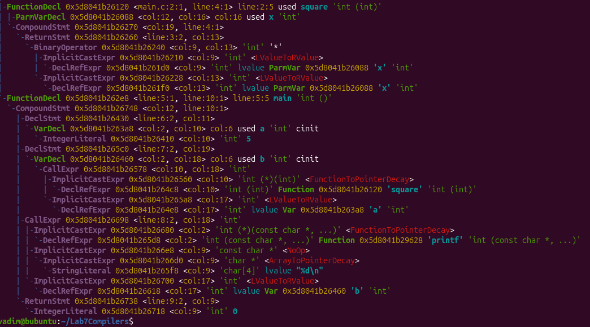

## Генерация LLVM.

Промежуточное представление кода без оптимизаций:

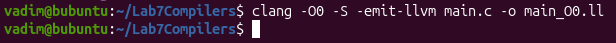

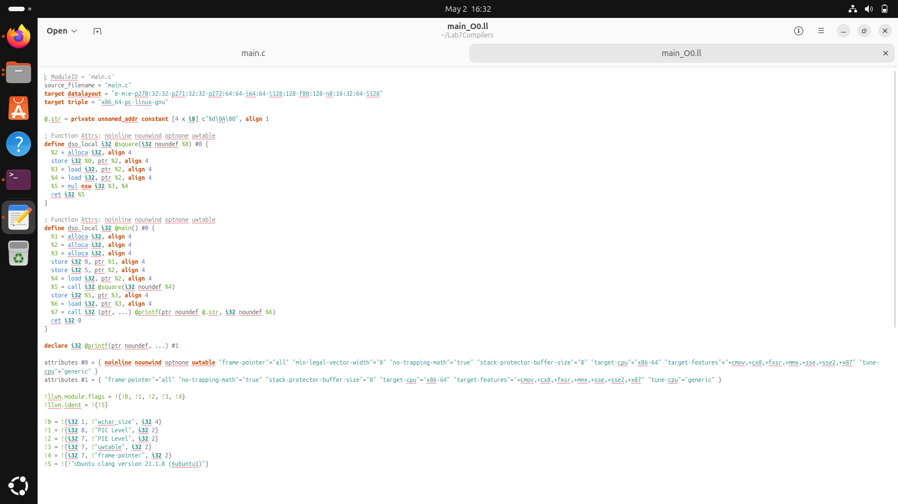

Промежуточное представление кода с комплексной оптимизацией среднего уровня O2:

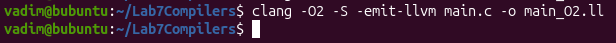

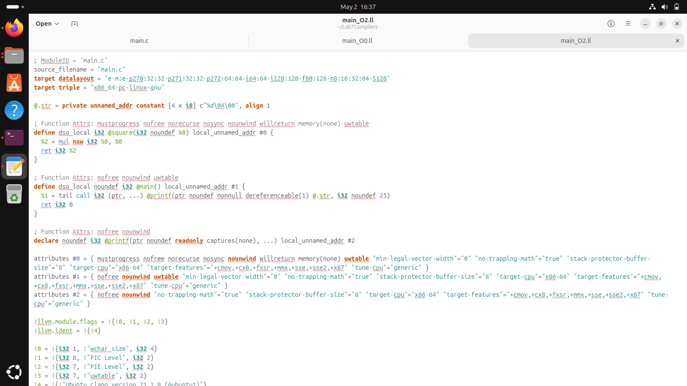

Разница между двумя представлениями:

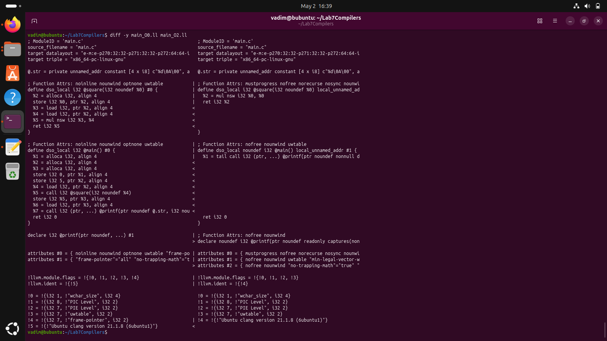

## Оптимизация IR.

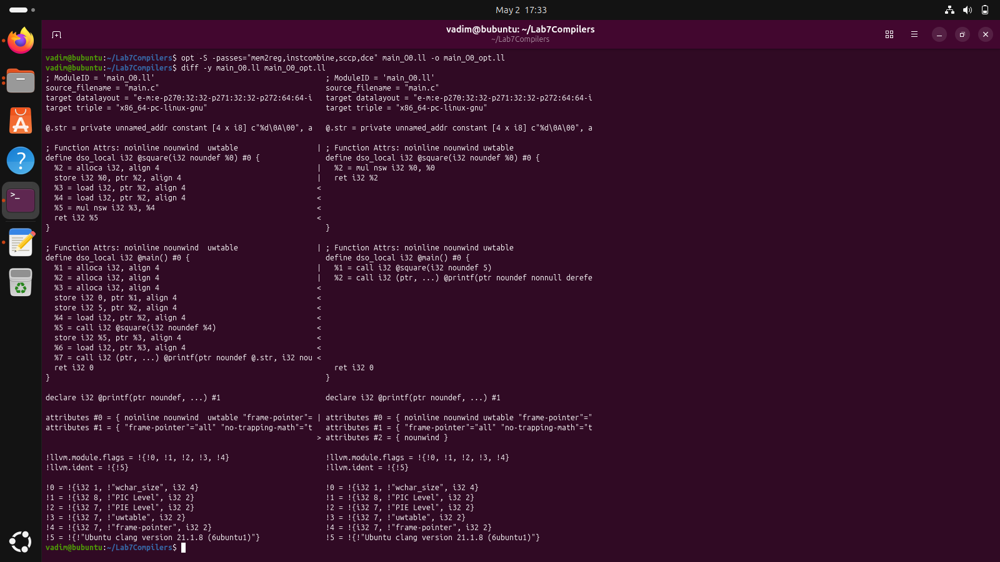

Список оптимизаций:

1. sccp - свертка констант, вычисление выражений.
2. mem2reg - заменяет alloca/store/load на регистры
3. instcombine - упрощает арифметические выражения
4. dce - удаляет неиспользуемые инструкции

После применения оптимизаций исчезли операции с памятью в промежуточном представлении кода. В функции main мы сразу передаем в square константу 5 без операций выделения, заполнения и вызова памяти. В функции square мы выделяем память только для того, чтобы хранить значение умножения. В функции square исчезли операции с памятью для левого и правого бинарного оператора умножения, а сразу подставляются указатели на значение в аргументе функции.

## Построение CFG.

Создание dot файлов:

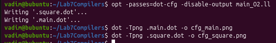

CFG функций:

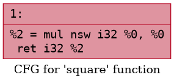

# Индивидуальное задание.

Исходный код:

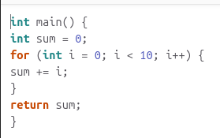

## Работа с AST.

