# Лабораторная работа 7. Анализ и преобразование кода с использованием Clang и LLVM.

Цель работы

Познакомиться с инструментарием Clang и LLVM, освоить получение абстрактного синтаксического дерева (AST) и промежуточного представления (LLVM IR) для кода на C/C++, научиться применять базовые оптимизации, строить графы потока управления (CFG), а также анализировать влияние оптимизаций на различные синтаксические конструкции языка.

# Автор.

Зенцов Вадим, АВТ-313

# Постановка задачи.

## Общее задание.

### Общий вариант задания:

#include <stdio.h>

int square(int x) {

 return x * x;

}

int main() {

 int a = 5;

 int b = square(a);

 printf("%d\n", b);

 return 0;

}

### Общая постановка задачи:

1. Установка среды

Установить Clang, LLVM, opt и Graphviz (например, в Ubuntu 26.04).

2. Работа с AST

Сгенерировать абстрактное синтаксическое дерево для заданного C/C++‑файла.

3. Генерация LLVM IR

Получить промежуточное представление кода без оптимизаций (-O0) и с оптимизациями (-O2).

4. Оптимизация IR

Применить оптимизации с помощью opt и/или флагов Clang, сравнить изменения.

5. Построение CFG

Построить граф потока управления для одной или нескольких функций.

6. Индивидуальное задание (по варианту)

Выполнить анализ конкретной синтаксической конструкции в соответствии с вариантом. Сформулировать, как LLVM обрабатывает выбранную конструкцию, какие оптимизации применяются.

7. Выводы

Ответить на контрольные вопросы

## Индивидуальное задание.

### Вариант задания:

int main() {

int sum = 0;

for (int i = 0; i < 10; i++) {

sum += i;

}

return sum;

}

### Задания:

1. Получите IR для -O0.

2. Получите IR для -O2. Раскрыт ли цикл?

3. Примените -unroll-count=4 и сравните.

4. Постройте CFG.

5. Сделайте вывод об оптимизации циклов в LLVM.

# Общее задание.

## Установка среды.

Лабораторная работа выполняется в ОС Ubuntu 26.04

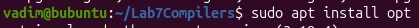

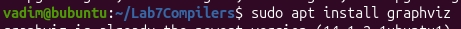

## Работа с AST.

Исходный файл:

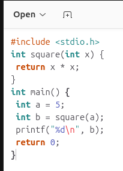

Получение AST:

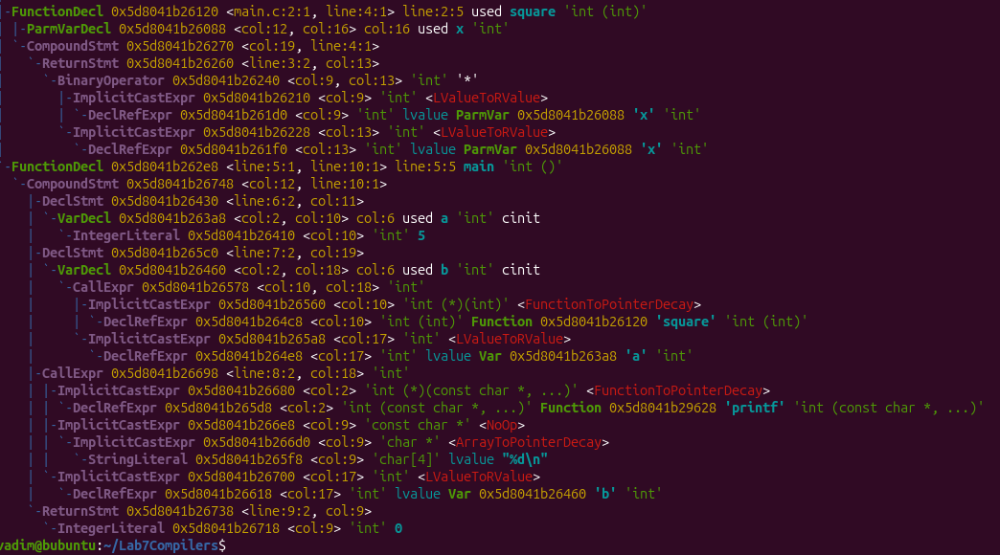

## Генерация LLVM.

Промежуточное представление кода без оптимизаций:

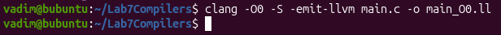

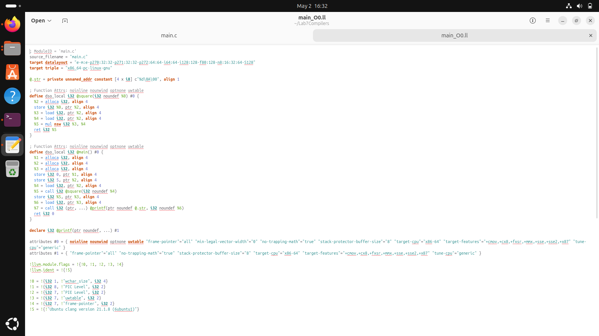

Промежуточное представление кода с комплексной оптимизацией среднего уровня O2:

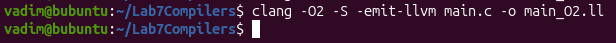

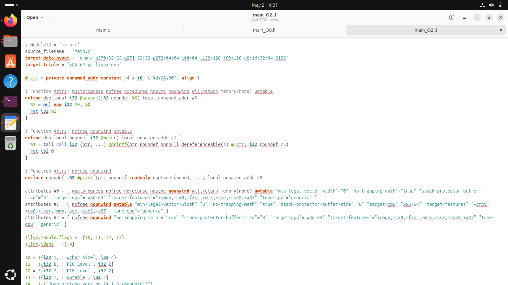

Разница между двумя представлениями:

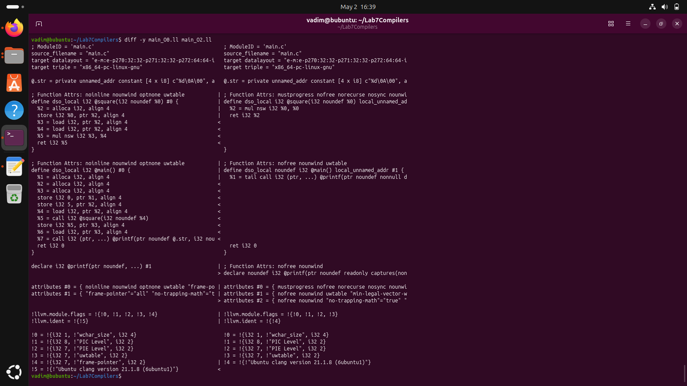

## Оптимизация IR.

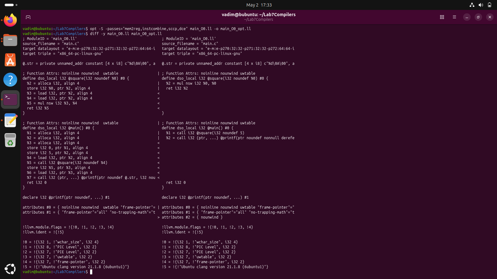

Список оптимизаций:

1. sccp - свертка констант, вычисление выражений.
2. mem2reg - заменяет alloca/store/load на регистры
3. instcombine - упрощает арифметические выражения
4. dce - удаляет неиспользуемые инструкции

После применения оптимизаций исчезли операции с памятью в промежуточном представлении кода. В функции main мы сразу передаем в square константу 5 без операций выделения, заполнения и вызова памяти. В функции square мы выделяем память только для того, чтобы хранить значение умножения. В функции square исчезли операции с памятью для левого и правого бинарного оператора умножения, а сразу подставляются указатели на значение в аргументе функции.

## Построение CFG.

Создание dot файлов:

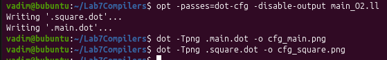

CFG функций:

# Индивидуальное задание.

Исходный код:

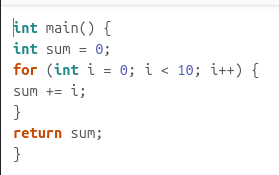

## Работа с AST.

AST цикла for:

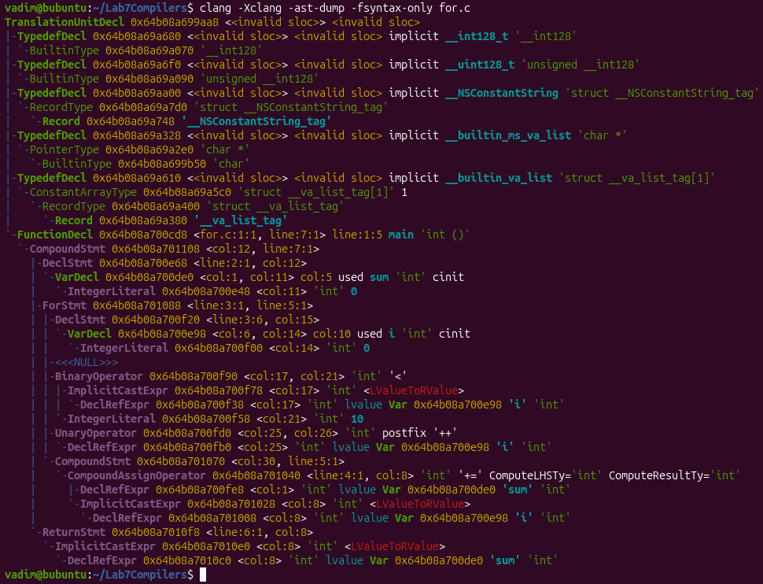

## Генерация LLVM IR.

Генерация LLVM IR -O0:

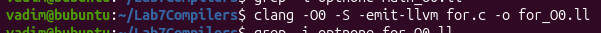

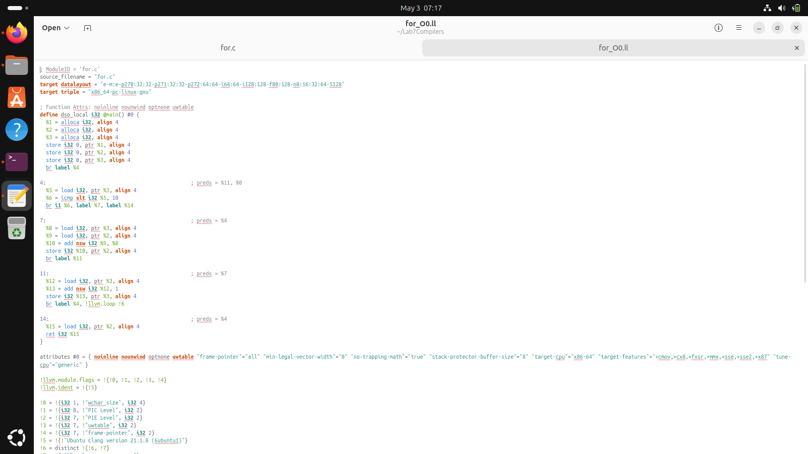

Генерация LLVM IR -O2:

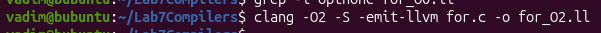

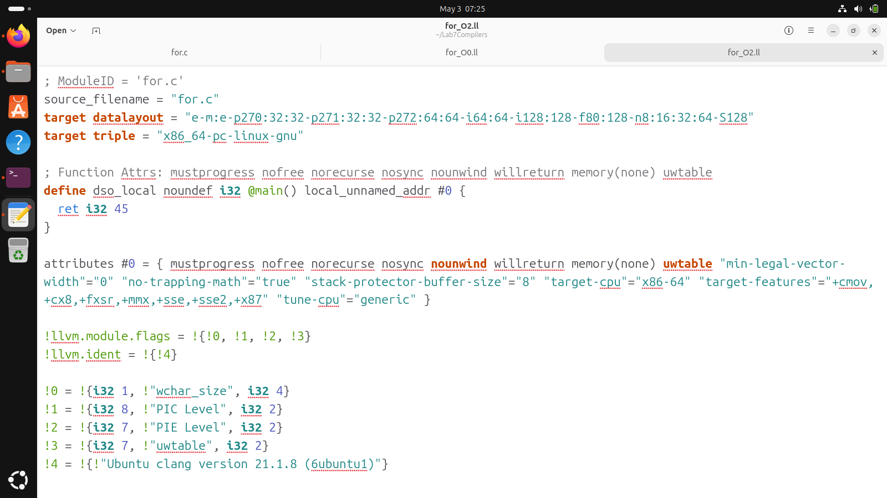

Мы можеем заметить, что после оптимизации -O2 цикл раскрылся, и заменился просто на константу 45.

## Оптимизация opt.

Применим к -O0 -unroll-count=4:

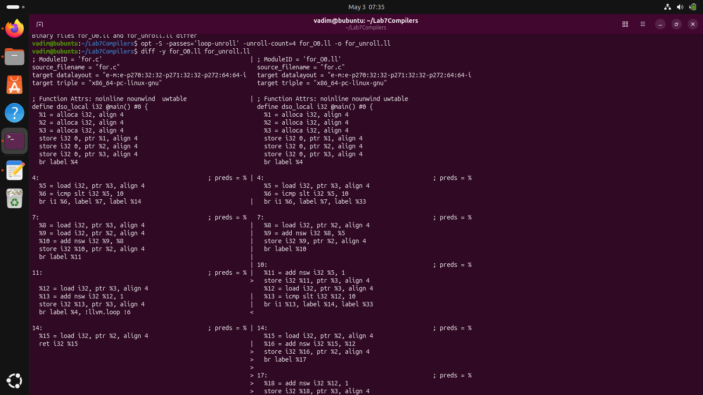

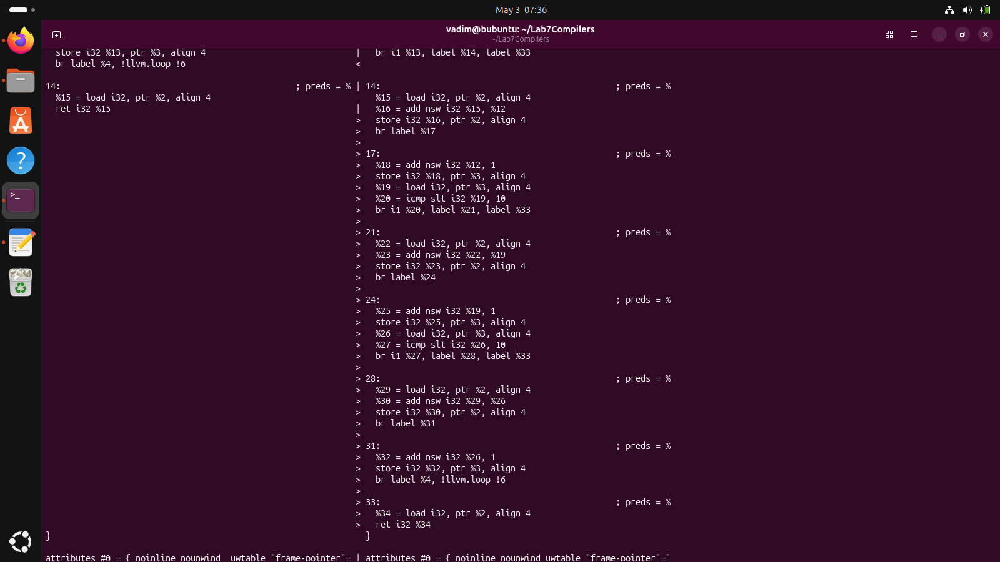

Мы можем заметить, что после проведения оптимизации количество итераций уменьшилось в 4 раза (с 10 до 3), что позволяет ускорить выполнение за счет сокращения количества проверок условий и переходов. Тело цикла увеличилось.

## Построение CFG.

CFG -O0 для цикла for:

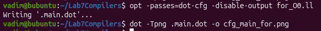

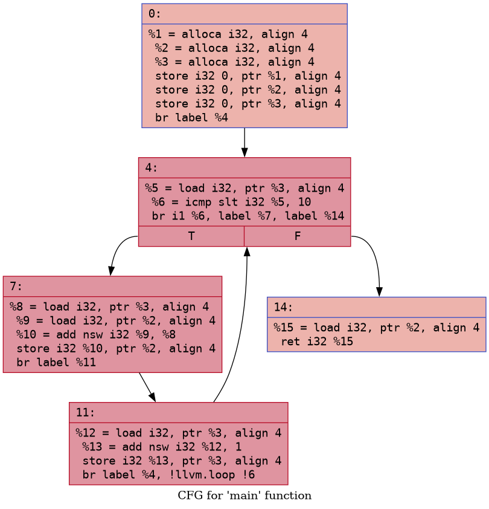

CFG -O2 для цикла for:

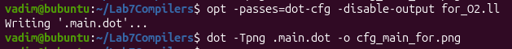

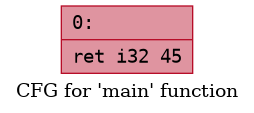

После применения оптимизации, функция main, в которой находится цикл for, сразу возвращает константу 45.

## Вывод об оптимизации циклов в LLVM.

LLVM предоставляет мощные инструменты для проведения оптимизаций языка C. В рамках лабораторной работы была проведена оптимизация цикла for на языке C. 
Как можно увидеть из CFG неоптимизированного цикла for, в нем происходит очень много действий, занимающих память и прибавляющих программе время выполнения. 
Цикл for выполняет следующие действия: выделение памяти для чисел, обращение к ячейкам памяти, запись значений в ячейки памяти, проверка условий, переход к началу цикла. 
В данном случае, цикл проходит заранее известные этапы работы и заранее известное выполнение действий. 
Мы можем оптимизировать работу цикла, заранее просчитав значение, которое мы получаем после работы цикла. 
LLVM отлично справился с поставленной задачей оптимизации, и сократил выполнение программы до простого возврата константы, равной 45, что видно из файла CFG, сгенерированного после оптимизации уровня -O2. 
Таким образом, LLVM предоставляет отличные возможности для оптимизации выполнения цикла for на языке C.

# Ответы на контрольные вопросы.

1. Что такое Clang, и какова его роль в процессе компиляции
программ?

Clang отвечает за перевод исходного кода на языке C/C++ в промежуточное представление. 
Он производит лексический, синтаксический, семантический анализ кода высокого уровня и возвращает промежуточное представление (LLVM IR). 
В дальнейшем промежуточное представление можно оптимизировать и подавать на выполнение машине.

2. Что представляет собой LLVM и как он используется в
современных компиляторах?

LLVM (Low Level Virtual Machine) - модульная система для построения компиляторов.

Она состоит из следующих частей: 
- Промежуточное представление (LLVM IR) - универсальный язык между исходным кодом и машинным кодом.
- Набор оптимизаций (opt).
- Генератор кода - преобразование IR в машинный код.

Современные языки допускают перевод своего кода в промежуточное представление LLVM IR, например, C/C++, Swift, Rust, Julia, что позволяет в дальнейшем оптимизировать код.

3. Чем отличается абстрактное синтаксическое дерево (AST) от
промежуточного представления LLVM IR?

AST - древовидная структура, отражающая синтаксис исходного языка. AST отражает конструкции высокого уровня, не может быть оптимизировано, содержит только синтаксические конструкции.

LLVM IR - промежуточное представление, не зависящее от синтаксиса языка. LLVM IR находится на низком уровне, близко к машинному коду, может быть оптимизировано, содержит операции с памятью и регистрами.

4. Для чего необходимо промежуточное представление (IR) в
процессе компиляции?

Без промежуточного представления для каждой отдельной платформы (x86, RISC) понадобилось бы писать свой компилятор, то есть, 2 языка и 2 платформы означает уже 4 компилятора, что не является эффективным.
Промежуточное представление структурирует код на языке высокого уровня, и выполняет его уже в зависимости от целевой платформы, что позволяет разделить ответственность между разработчиками языков и создателями платформ.
Оптимизации являются одинаковыми для всех промежуточных представлений, не нужно писать под каждый отдельный язык уже готовые оптимизации, предоставляемые LLVM IR.

5. Что делает инструкция alloc в LLVM IR, и зачем она
используется в функциях?

Выделяет память на стеке для локальных переменных функции. Чтобы дать значение переменной, нужно выделить место, где оно будет храниться.

6. Зачем нужна оптимизация кода в компиляторе, и какие
основные цели она преследует?

- Уменьшить время выполнения программы.
- Уменьшить размер кода.
- Уменьшить использование памяти.

7. Что такое SSA-форма и почему она важна при оптимизации
программ?

SSA (Static Single Assignment) - форма промежуточного представления, где каждая переменная записывается только один раз. Если переменная меняет значение, то создается новая, а не перезаписывается старая.

SSA важна в оптимизации по этим причинам:

- Так как каждая переменная неизменна, это позволяет провести свертку констант.
- Обнаружение неиспользуемого кода. Если указатель на какое-то значение нигде больше не используется, его можно удалить.
- Удаление общих подвыражений. Например, если двум переменным присваивается значение a+b, то можно его один раз посчитать и присвоить обеим переменным, а не считать одно и то же несколько раз.

8. Что такое граф потока управления (CFG) и как он помогает
анализировать поведение программы?

CFG - это граф, который показывает все возможные пути выполнения программы. Вершины - базовые блоки, инструкции без ветвлений, ребра - переходы между ними. Он показывает оптимизатору все возможные маршруты выполнения программы, чтобы можно было понять, где циклы, где мертвый и недостижимый код, какие оптимизации безопасны.

9. Как устроено представление арифметических операций в
LLVM IR (например, умножение, сложение)?

<результат> = <операция> <тип> <операнд1>, <операнд2>

10. Почему функции в LLVM IR обычно представляют собой
отдельные единицы анализа и оптимизации?

- Оптимальнее разбить код на много функций, и анализировать каждую в ограниченном контексте.
- В ограниченном контексте функции не нужно учитывать влияние извне (кроме глобальных переменных).
- Возможность оптимизировать каждую функцию в отдельном потоке для повышения производительности.

11. Что происходит с функцией в LLVM IR, если она вызывается
один раз и очень короткая?

Ее можно встроить в место вызова.

12. Какие преимущества даёт использование IR и CFG для
автоматических оптимизаций по сравнению с анализом исходного текста
на C?

- Убирает синтаксический сахар. Например, x++ и ++x и x+1 - одно и то же, поэтому заменится на универсальный %x_new = add i32 %x_old, 1

- CFG показывает пути выполнения наглядно.

- Неизменность переменных (SSA).

# Дополнительное задание.

## AST цикла for на языке scala.

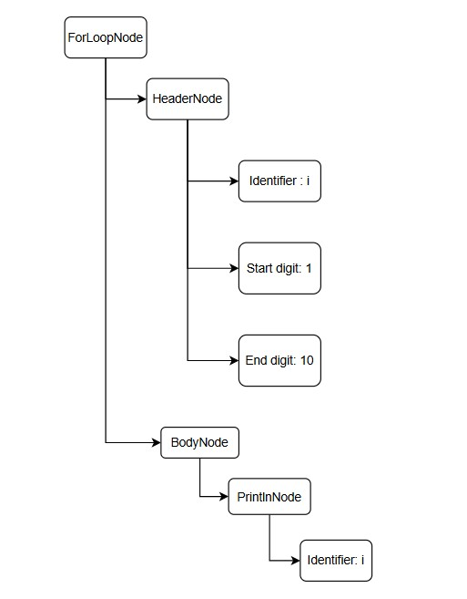

## Результаты оптимизации.

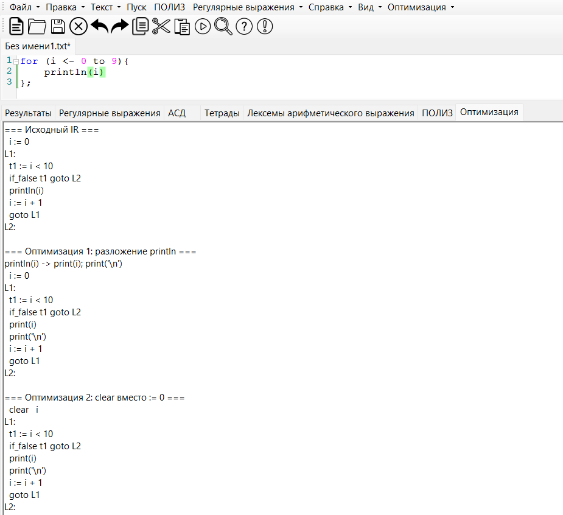

## Блок схемы оптимизаций.

Оптимизация замены инструкции присваивания 0 на clear

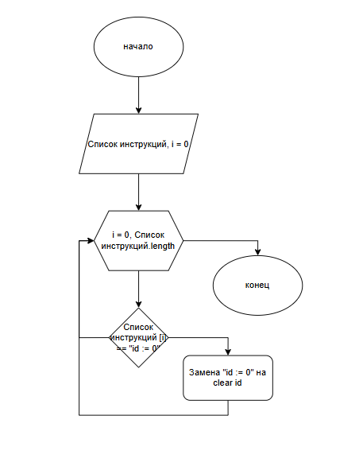

Оптимизация замены инструкции println на два атомарных print

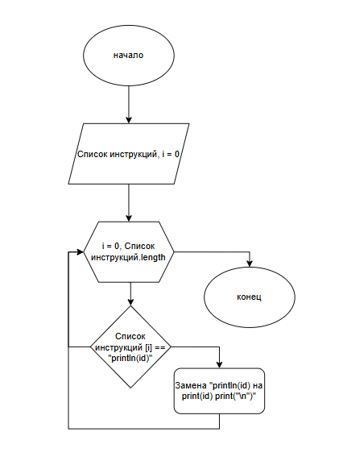