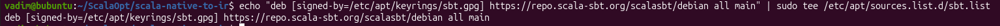
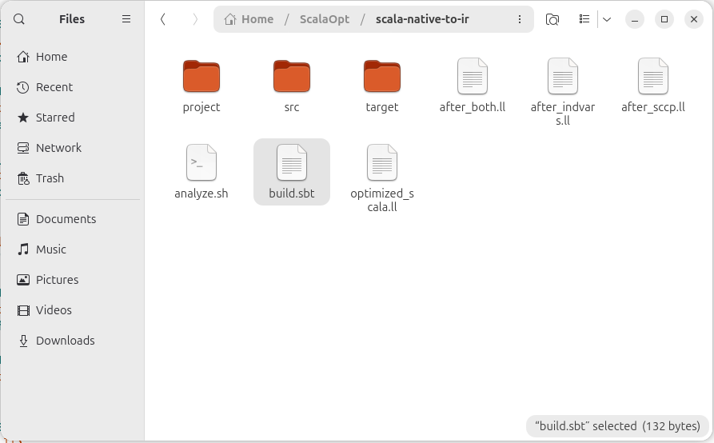
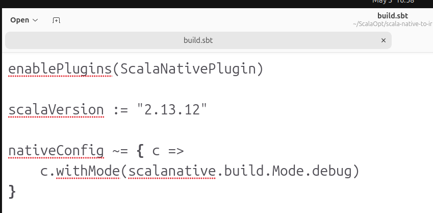
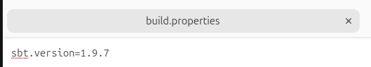
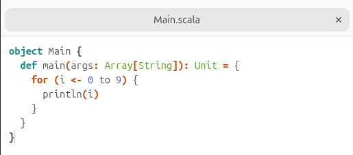
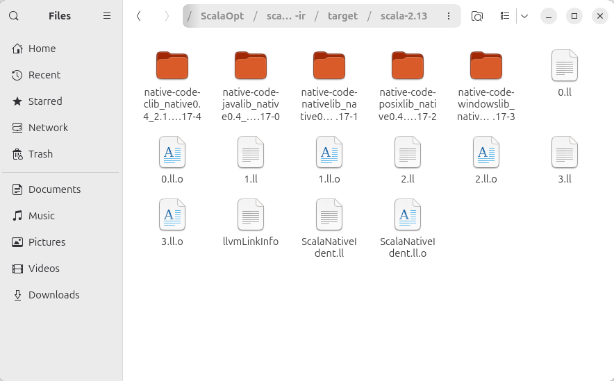
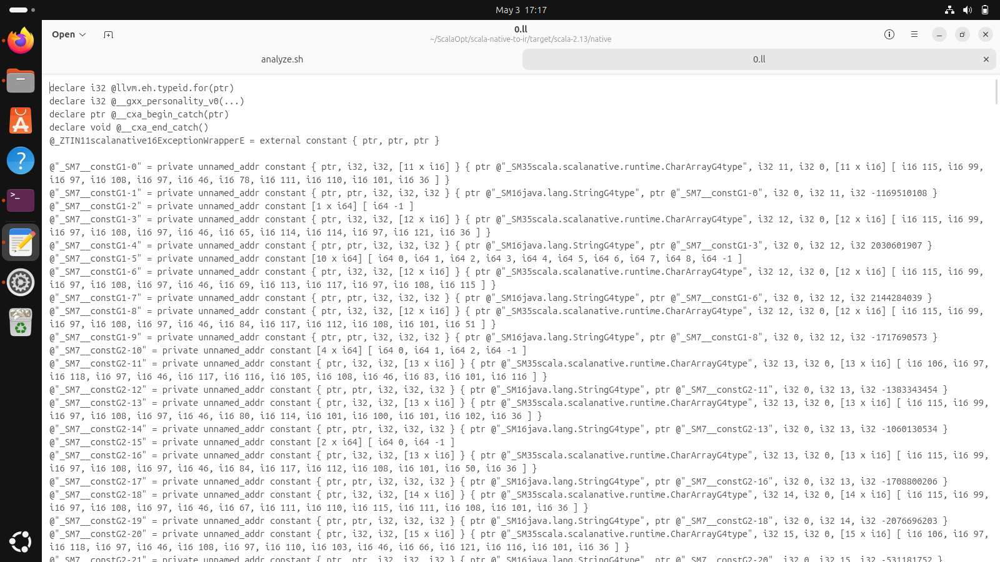
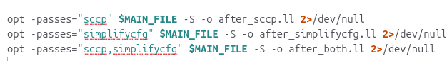
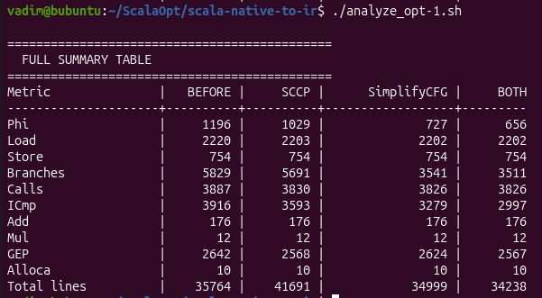

## Генерация промежуточного представления (IR) для цикла for на языке Scala.

Обновление информации о доступных пакетах.

Скачивание пакетов curl и gnupg.

Устанавливаем цифровой ключ для безопасного скачивания пакетов Scala Build Tools.

Даем права apt на чтение ключа.

Добавляем официальный репозиторий Scala.

Снова обновляем информацию о доступных пакетах.

Устанавливаем Scala Build Tool.

Устанавливаем остальные необходимые пакеты.

Создаем папку проекта на языке Scala.

Перед первым запуском sbt необходимо настроить файлы конфигурации.

build.sbt

build.properties

plugins.sbt

Main.scala

Выполняем сборку sbt.

Файлы LLVM IR после выполнения сборки проекта scala.

Сгенерированный IR -O0 для цикла for на языке scala.

## Оптимизация IR.

Создадим скрипт для терминала bash, который создаст файлы со следующими оптимизациями:

- sccp - свертка констант.

- simplifycfg - упрощение графа потока управления, уничтожение избыточных и бесполезных структур.

## Сравнение неоптимизированных и оптимизированных IR.

Проведем сбор следующей статистики в файлах IR:

- phi - выбор значения в зависимости от того, откуда пришло управление.
- load - операции чтения данных из памяти в регистр.
- store - запись данных из регистра в память.
- branch instructions - инструкции перехода.
- function calls - вызовы других функций.
- icmp - сравнение двух чисел.
- add - операции сложения.
- mul - операции умножения.
- GEP - вычисление адреса элемента в структуре (массиве).
- alloca - выделение стековой памяти.
- общее количество строк в файле.

Итоговая таблица сравнений IR:

Таким образом, можно сделать вывод, что после применения обеих оптимизаций исчезли почти половина phi - инструкций, 40% ветвлений, 20% сравнений двух чисел. Все остальные инструкции либо изменились слабо (менее 5%), либо не изменились вовсе. Оптимизация цикла for на языке scala с помощью параметров sccp и simplifycfg является эффективной, а их сочетание дает наилучший результат.