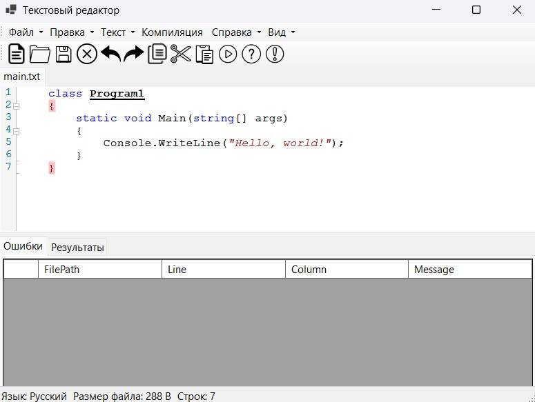

# Лабораторная работа 1. Разработка пользовательского интерфейса (GUI) для языкового процессора.  

## Цель работы.  

Создание кроссплатформенного графического интерфейса (GUI) для языкового процессора в виде специализированного текстового редактора.  

## Описание проекта.  

Графический интерфейс языкового процесса, который поддерживает базовые операции с текстом и файлами,   
имеет справочную информацию, базовую подсветку синтаксиса и интернационализацию.  

## Используемые технологии:  

Язык программирования: C#.  
Фреймворк для GUI: Windows Forms.  
Среда разработки: Visual Studio.  

## Инструкция по сборке и запуску:  

Путь к исплняемому файлу:  
"..\bin\Debug\net9.0-windows\Compiler Lab1.exe"  

## Описание интерфейса и функций (руководство пользователя)

Текстовый редактор - Руководство пользователя 

### Меню "Файл" - Alt+F  

Создать - открывает новый пустой файл - Ctrl+N  

Открыть - открывает имеющийся на компьютере файл в формате .txt - Ctrl+O  

Сохранить - если редактируемый файл имеет место сохранения на компьютере, то редактированный файл сохраняется со всеми изменениями вместо старого. Если файл сохраняется впервые, то открывается диалоговое окно, предлагающее пользователю сохранить файл в любом месте в формате .txt - Ctrl+S  

Сохранить как - открывает диалоговое окно, предлагающее пользователю сохранить редактируемый файл в удобном для него месте - Ctrl+Shift+S

Закрыть - вкладку закрывает текущую вкладку - Ctrl+W

Выход - выход из приложения

### Меню "Правка" - Alt+E

Отменить - отменяется последнее действие пользователя - Ctrl+Z

Вернуть - восстановление ранее отмененного действия пользователя - Ctrl+Y

Вырезать - сохранение выделенного текста в буфере обмена с последующим его удалением - Ctrl+X

Копировать - сохранение выделенного текста в буфере обмена - Ctrl+C

Вставить - занесение в поле ввода сохраненного в буфере обмена текста - Ctrl+V

Удалить - удаление выделенного текста - Del

Выделить все - выделяет весь текст в поле ввода - Ctrl+A

### Меню "Текст" - Alt+T

Постановка задачи

Грамматика

Классификация грамматики

Метод анализа

Тестовый пример

Список литературы

Исходный код программы

### Кнопка "Компиляция"
Запуск - запускает процесс компиляции и анализа введенного кода. Результаты отображаются в окне вывода - F5

### Меню "Справка" - Alt+C

Вызов справки - описание реализованных функций (текущий документ) - F1

О программе - описание приложения и контактная информация - F12

### Меню "Вид" - Alt+V

Выбор размера шрифта - нужный размер шрифта выбирается из выпадающего списка. Доступны размеры от 8 до 72

Выбор локализации - нужный язык интерфейса выбирается из выпадающего списка. Поддерживаются русский и английский языки

### Интерфейс программы

