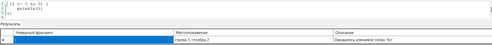
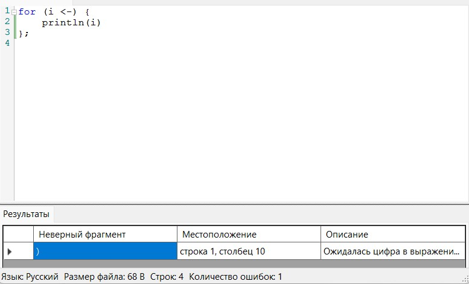

# Лабораторная работа 3. Разработка синтаксического анализатора (парсера).

## Цель работы.  

Изучить назначение и принципы работы синтаксического анализатора в структуре компилятора. 
Спроектировать грамматику, построить соответствующую схему метода анализа грамматики и выполнить программную реализацию парсера с нейтрализацией синтаксических ошибок методом Айронса. 
Интегрировать разработанный модуль в ранее созданный графический интерфейс языкового процессора.

## Сведения об авторе.

Разработал Зенцов Вадим, АВТ-313.

## Постановка задачи

Разработать синтаксический анализатор (парсер) в соответствии с индивидуальным вариантом курсовой (расчетно-графической) работы, 
интегрировать его в приложение из лабораторной работы №1 
и обеспечить наглядный вывод результатов анализа.

## Вариант задания.  

111. Цикл for на языке Scala  

for (i <- 0 to 9) {  
    println(i)  
};  
  
for (a <- 11 to 10000) {  
    println(a)  
    println(b)  
    println(c)  
};  

for (i <- 0 to 9) {  

};  

## Разработка грамматики.

Грамматика, разработанная в рамках лаюораторной работы. Данная грамматика является контекстно-свободной:

[grammar.txt](grammar.txt)

## Метод анализа.

## Тестовые примеры.

# Лабораторная работа 4. Реализация алгоритма поиска подстрок с помощью регулярных выражений

## Сведения об авторе 

Разработал Зенцов Вадим, АВТ-313

## Постановка задачи

Разработать модуль поиска подстрок с использованием регулярных выражений, 
интегрировать его в существующее приложение (текстовый редактор) и обеспечить наглядный вывод результатов.

