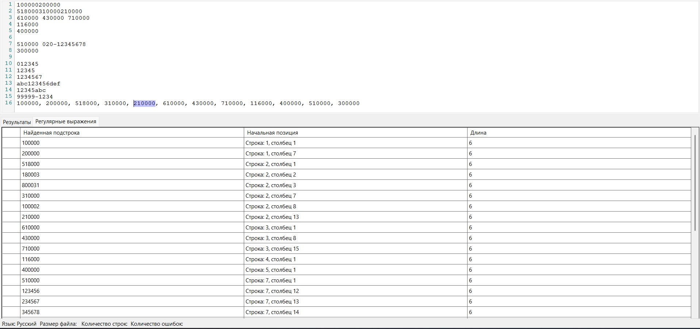
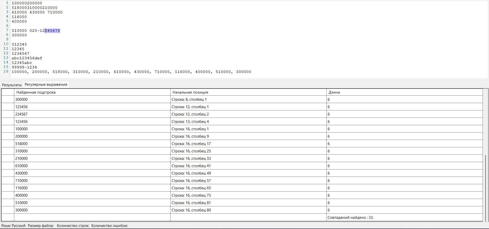
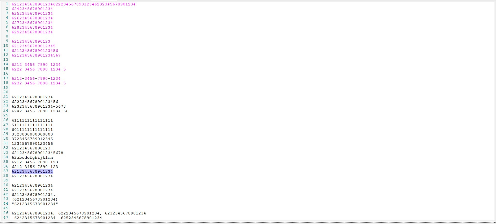
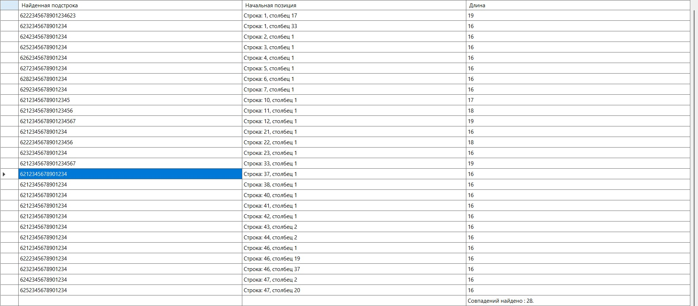
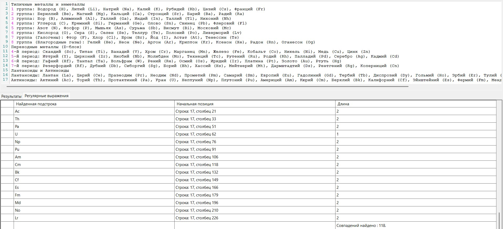

# Лабораторная работа 3. Разработка синтаксического анализатора (парсера).

## Цель работы.  

Изучить назначение и принципы работы синтаксического анализатора в структуре компилятора. 
Спроектировать грамматику, построить соответствующую схему метода анализа грамматики и выполнить программную реализацию парсера с нейтрализацией синтаксических ошибок методом Айронса. 
Интегрировать разработанный модуль в ранее созданный графический интерфейс языкового процессора.

## Сведения об авторе.

Разработал Зенцов Вадим, АВТ-313.

## Постановка задачи

Разработать синтаксический анализатор (парсер) в соответствии с индивидуальным вариантом курсовой (расчетно-графической) работы, 
интегрировать его в приложение из лабораторной работы №1 
и обеспечить наглядный вывод результатов анализа.

## Вариант задания.  

111. Цикл for на языке Scala  

for (i <- 0 to 9) {  
    println(i)  
};  
  
for (a <- 11 to 10000) {  
    println(a)  
    println(b)  
    println(c)  
};  

for (i <- 0 to 9) {  

};  

## Разработка грамматики.

Грамматика, разработанная в рамках лаюораторной работы. Данная грамматика является контекстно-свободной:

[grammar.txt](grammar.txt)

## Метод анализа.

## Тестовые примеры.

# Лабораторная работа 4. Реализация алгоритма поиска подстрок с помощью регулярных выражений

## Сведения об авторе 

Разработал Зенцов Вадим, АВТ-313

## Постановка задачи

Разработать модуль поиска подстрок с использованием регулярных выражений, 
интегрировать его в существующее приложение (текстовый редактор) и обеспечить наглядный вывод результатов.

1 Задание: Построить РВ, описывающее китайские почтовые индексы.

2 Задание: Построить РВ, описывающее номера карт, принадлежащих платежной системе UnionPay.

3 Задание: Построить РВ для поиска любого химического элемента из таблицы Менделеева (118 элементов).

## Задание 1.

### Описание задачи.

Построить РВ, описывающее китайские почтовые индексы. 

Китайские почтовые индексы состоят из 6 цифр, первая не может быть 0.

### Регулярное выражение с пояснением каждого обозначения.

(?=([1-9]\d{5}))

?= - означает, что курсор не должен двигаться за пределы найденной группы.

[1-9] - первая цифра, не включая 0.

\d - метасимвол цифры от 0 до 9.

{5} - квантификатор количества повторений, в данном случае 5 цифр.

### Примеры строк, которые должны находиться.

100000  

200000

518000

310000

### Примеры строк, которые не должны находиться.

000000 - начинается с нуля.

12345 - слишком маленькое число.

12ab56 - в середине строки находятся буквы.

### Тестовый пример.

## Задание 2.

### Описание задачи.

Построить РВ, описывающее номера карт, принадлежащих платежной системе UnionPay.

Номера данных карт должны начинаться с 62, далее может быть любая цифра. Допустиммый размер номера карт - от 16 до 19.

### Регулярное выражение с пояснением каждого обозначения.

(?=(62\d{14,17}))

?= - означает, что курсор не должен двигаться за пределы найденной группы.

62 - означает, что данная подстрока должна начинаться с 62.

\d - метасимвол цифры от 0 до 9.

{14,17} - квантификатор числа повторений, в данном случае количество цифр может быть от 14 до 17.

### Примеры строк, которые должны находиться.

6292345678901234

6212345678901234567

### Примеры строк, которые не должны находиться.

621234567890123 - слишком мало символов.

6212 3456 7890 1234 - есть пробелы внутри строки.

6222 3456 7890 1234 5 - есть пробелы внутри строки.

6212-3456-7890-1234 - есть неправильные символы внутри строки.

6232-3456-7890-1234-5 - есть неправильные символы внутри строки.

4111111111111111 - начинается не с 62.

62abcdefghijklmn - включает сторонние символы.

### Тестовый пример.

## Задание 3.

### Описание задачи.

Построить РВ для поиска любого химического элемента из таблицы Менделеева (118 элементов).

### Регулярное выражение с пояснением каждого обозначения.

\b(H|He|Li|Be|B|C|N|O|F|Ne|Na|Mg|Al|Si|P|S|Cl|Ar|K|Ca|Sc|Ti|V|Cr|Mn|Fe|Co|Ni|Cu|Zn|Ga|Ge|As|Se|Br|Kr|Rb|Sr|Y|Zr|Nb|Mo|Tc|Ru|Rh|Pd|Ag|Cd|In|Sn|Sb|Te|I|Xe|Cs|Ba|La|Ce|Pr|Nd|Pm|Sm|Eu|Gd|Tb|Dy|Ho|Er|Tm|Yb|Lu|Hf|Ta|W|Re|Os|Ir|Pt|Au|Hg|Tl|Pb|Bi|Po|At|Rn|Fr|Ra|Ac|Th|Pa|U|Np|Pu|Am|Cm|Bk|Cf|Es|Fm|Md|No|Lr|Rf|Db|Sg|Bh|Hs|Mt|Ds|Rg|Cn|Nh|Fl|Mc|Lv|Ts|Og)\b

\b - метасимвол границы слова.

| - метасимвол со значением "ИЛИ".

### Примеры строк, которые должны находиться.

H

Li

Ca

Na

Rb

### Примеры строк, которые не должны находиться.

Ol - не в таблице Менделеева.

Pl - не в таблице Менделеева.

Lo - не в таблице Менделеева.

### Тестовый пример.

