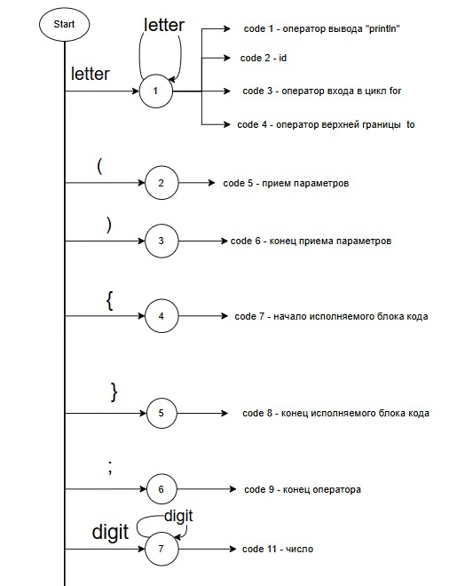
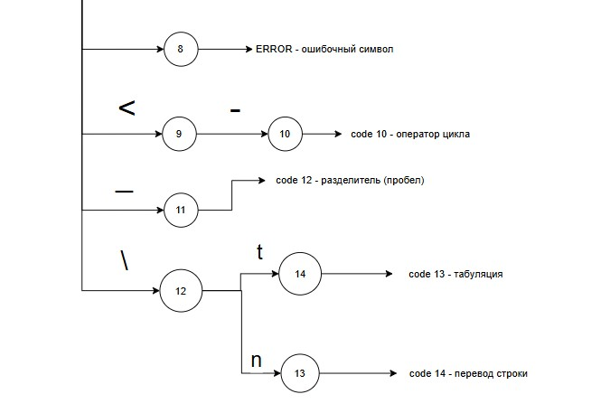
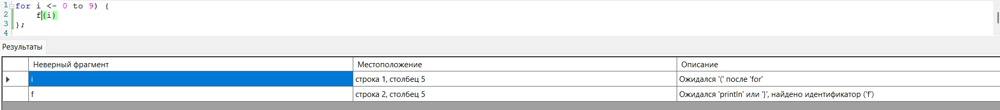
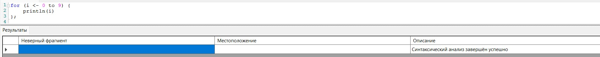
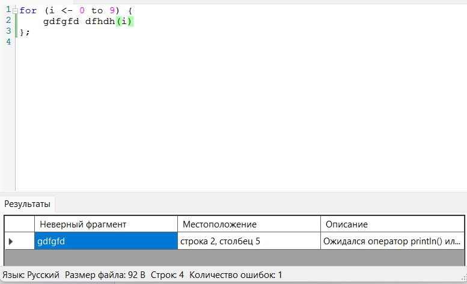

# Лабораторная работа 2. Разработка лексического анализатора (сканера).

## Цель работы.  

Изучить назначение и принципы работы лексического анализатора в структуре компилятора. 
Спроектировать алгоритм (диаграмму состояний) и выполнить программную реализацию сканера для выделения лексем из входного текста. 
Интегрировать разработанный модуль в ранее созданный графический интерфейс языкового процессора. 

## Сведения об авторе.

Разработал Зенцов Вадим, АВТ-313.

## Вариант задания.  

111. Цикл for на языке Scala  

for (i <- 0 to 9) {  
    println(i)  
};  
  
for (a <- 11 to 10000) {  
    println(a)  
};  

## Диаграмма состояний:  

Конечный автомат лексического анализатора предназначен 
для распознавания токенов языка Scala (цикл for) 
и реализует алгоритм последовательного чтения символов 
входного потока с переходом между состояниями 
в зависимости от прочитанных символов.

## Тестовые примеры.

## Грамматики.

Грамматика, разработанная в рамках лаюораторной работы. Данная грамматика является контекстно-свободной, так как правила вида A → α, где левая часть - один нетерминал:

[grammar.txt](grammar.txt)

Грамматика для Flex. Данная грамматика является регулярной, так как правила соответствуют регулярным выражениям Правила соответствуют регулярным выражениям A → aB или A → a:

[grammarFlex.txt](grammarFlex.txt)
